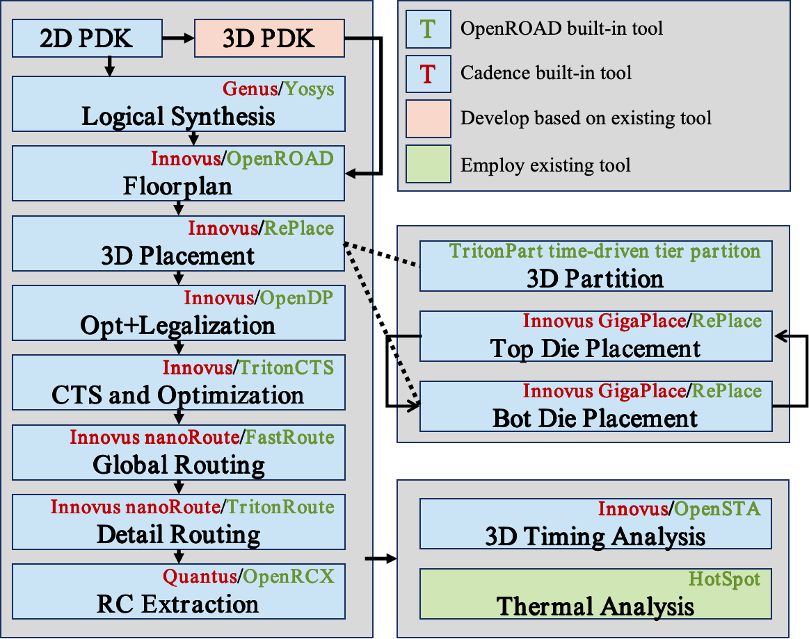
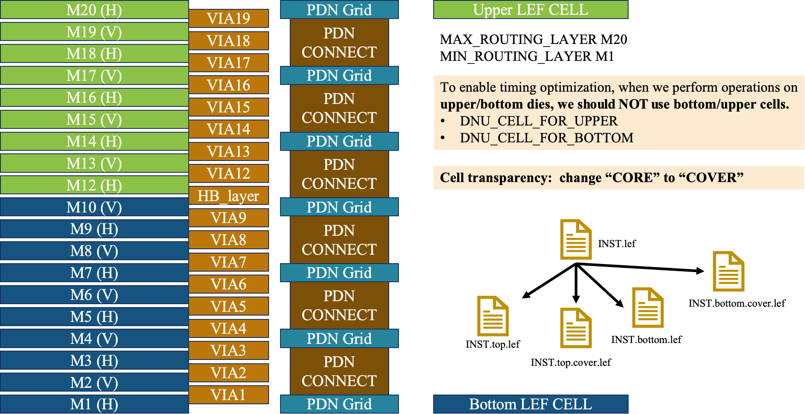
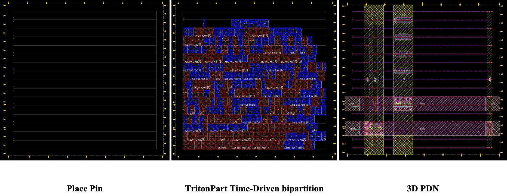
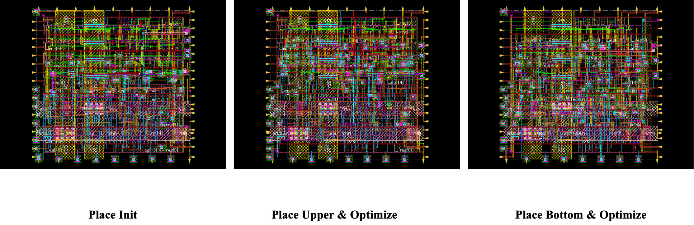
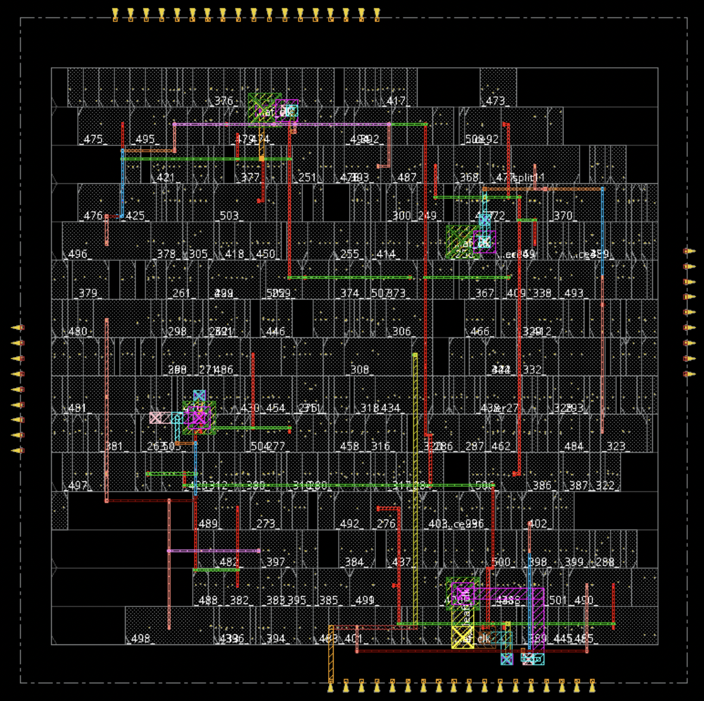
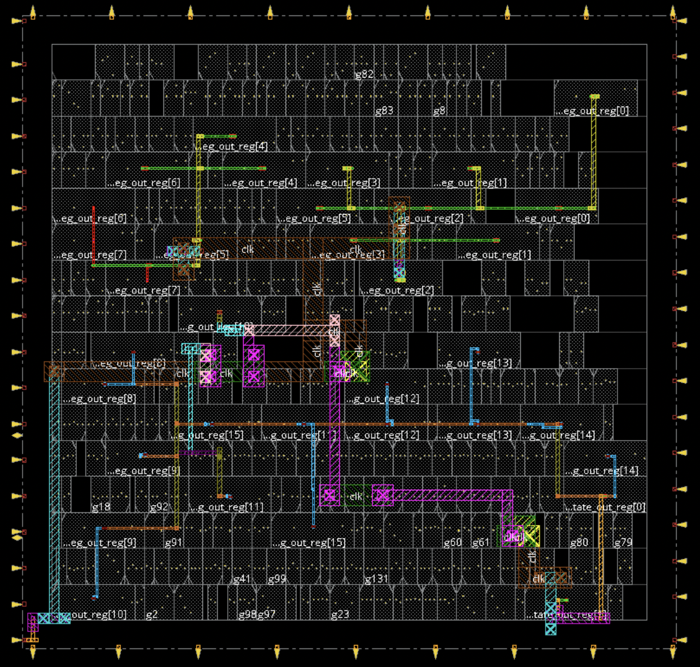
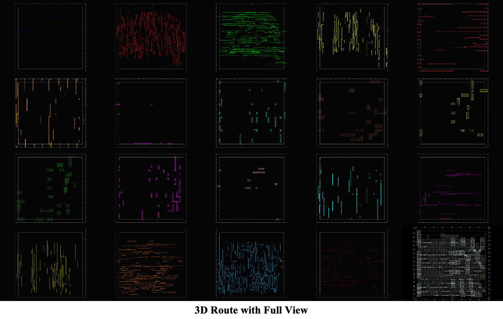
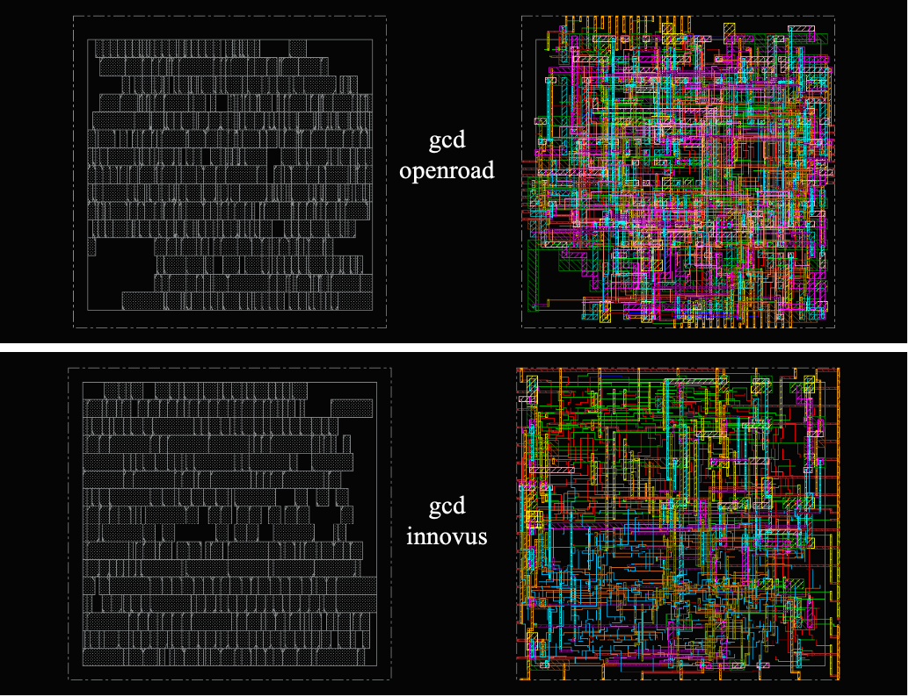
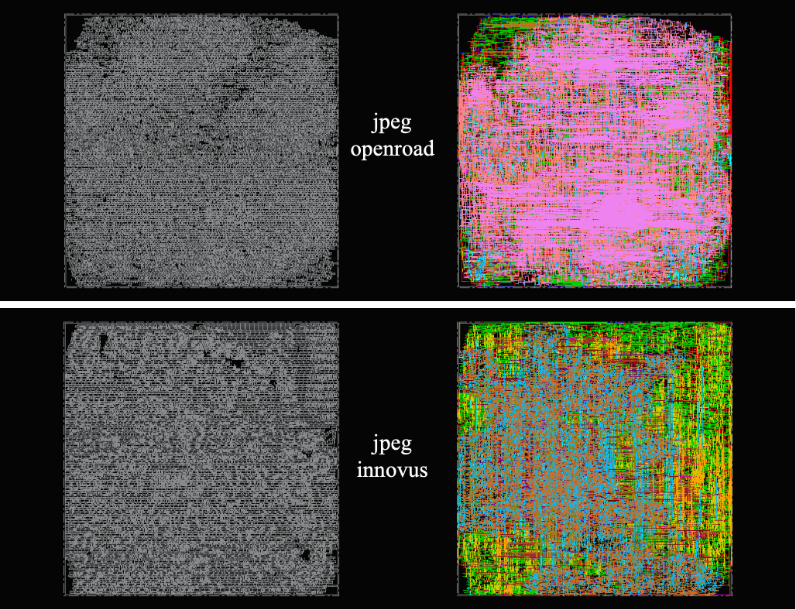
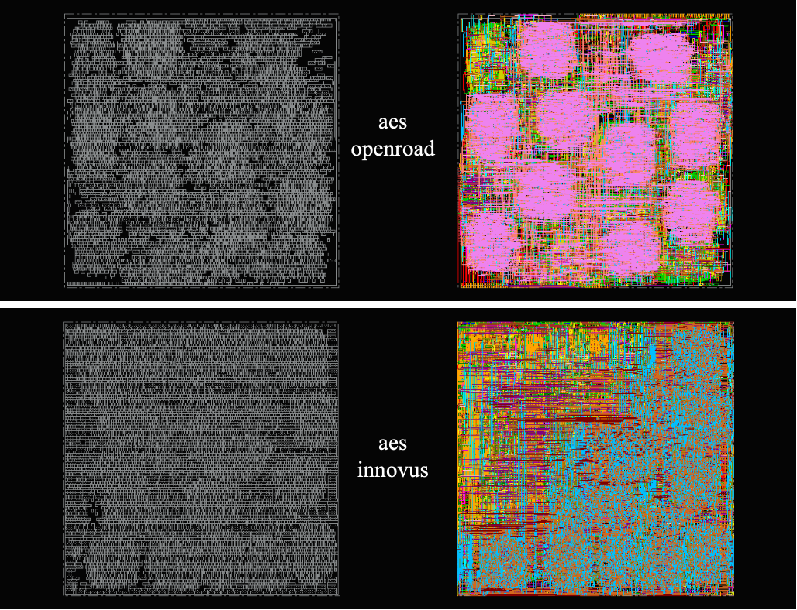

# ORFS-Research / flow-Pin3D

This project is led by students at Fudan University. Our goal is to develop a reproducible physical design (PD) flow for 3D ICs that is implemented with proven 2D toolchains—specifically OpenROAD’s OpenROAD-flow-scripts (ORFS) and Cadence tools—so that academic researchers can validate and compare their 3D design methods in a full flow.

3D design methods are crucial to improving performance, reducing power, and saving area. However, there remains a substantial gap between 3D design methodology and today’s EDA implementations, which limits broad adoption and rigorous validation.

For many years, both open-source and commercial ecosystems have primarily advanced 2D toolchains. While we now have mature 2D PD flows for VLSI, native 3D design platforms and tools remain scarce.

Although the research community has proposed many 3D ideas, methodologies, and tools, a general, easy-to-use, and reproducible 3D design flow is still lacking. As a result, individual 3D techniques are difficult to realize as robust prototypes and to evaluate within an end-to-end implementation flow.

This work enables researchers to integrate their own 3D design methods and prototypes into either commercial or open-source flows, and to evaluate them across the complete 3D IC PD flow.

Building on OpenROAD-flow-scripts (ORFS) and the Cadence toolchain, we develop a hybrid, 2D-tools–driven flow for Face-to-Face (F2F) 3D ICs with Hybrid Bonding Terminals (HBTs).

We do not make value judgments about commercial EDA tools. We welcome suggestions for improvements or contributions of better materials to this repository.

Please contact us via email or through GitHub issues and pull requests; our contact information is listed below. Finally, please read the header notices in all TCL scripts that invoke commercial EDA tools. We thank Cadence and Synopsys for allowing us to share, in this academic context, excerpts of their copyrighted intellectual property for researchers’ use.

## Contacts

*   **Zhiang Wang** — [zhiangwang@fudan.edu.cn](mailto:zhiangwang@fudan.edu.cn)
*   **Zhiyu Zheng** — [zyzheng24@m.fudan.edu.cn](mailto:zyzheng24@m.fudan.edu.cn)
*   **Keren Zhu** — [krzhu@fudan.edu.cn](mailto:krzhu@fudan.edu.cn)
*   **Yuhao Ren** — [yhren24@m.fudan.edu.cn](mailto:yhren24@m.fudan.edu.cn)

## Table of Contents

*   [Design Enablement](#design-enablement)
*   [Our Method](#our-method)

  *   [ORFS-Research Pin-3D Flow Overview](#orfs-research-pin-3d-flow-overview)
  *   [3D PDK Mapping (F2F with HBTs)](#3d-pdk-mapping-f2f-with-hbts)
  *   [2D Synthesis](#2d-synthesis)
  *   [2D and 3D Floorplan](#2d-and-3d-floorplan)
  *   [3D Placement & Optimization](#3d-placement--optimization)
  *   [3D Clock Tree Synthesis & Legalization](#3d-clock-tree-synthesis--legalization)
  *   [3D Routing](#3d-routing)
  *   [Extraction & Metrics](#extraction--metrics)
*   [Quick Start](#quick-start)

  *   [Prerequisites](#prerequisites)
  *   [One-line End-to-End Runs](#one-line-end-to-end-runs)
  *   [Stage-by-Stage (Make targets)](#stage-by-stage-make-targets)
*   [Outputs](#outputs)
*   [References](#references)
*   [Appendix](#Appendix)

  *   [Experimental Tables and Plots](#Experimental-Tables-and-Plots)

## Design Enablement

We provide a minimal, research‑ready enablement to run a **2D‑tools–driven Pin‑3D flow** on both OpenROAD (ORFS) and Cadence. You may plug in your own PDKs, libraries, and RC models (respecting licenses). A typical setup includes: 2D and 3D PDK files, PDN strategies, and timing/RC libraries.

|                          | OpenROAD (ORFS) & Innovus (Cadence)          |
| :----------------------- | :------------------------------------------- |
| Physical library         | 2D & 3D LEF / tech LEF (REAL and COVER)      |
| Liberty timing           | `.lib` (one or more corners)                 |
| PDN strategy             | `.tcl` (ORFS and Cadence)                    |
| RC lookup (for precise)  | `.rules`, `.tch` (QRC)                       |
| Parasitic extraction     | OpenRCX / Quantus (QRC)                      |

> Notes: (i) 3D F2F vertical interconnect (HBTs) is modeled via library pins/macros and/or pseudo‑layers; (ii) Our 2D and 3D PDK are takern from [[]].

## Our Method

### ORFS-Research Pin-3D Flow Overview

Our flow targets **Face‑to‑Face (F2F) 3D ICs with Hybrid Bonding Terminals (HBTs)**. We deliberately **reuse proven 2D capabilities** and add just enough cross‑die abstractions and constraints so new 3D research modules can be **inserted, replaced, or ablated** with minimal friction.

<p align="center">
  
</p>

High‑level stages and the **actual make targets** used in this repo are:

1.  **Per‑die 2D Synthesis** → gate‑level netlists
  *Targets:* `ord-synth` / `cds-synth` (with `config2d.mk`).
2.  **2D → 3D Floorplanning & Tiering** → floorplan/IO, tier partition, 3D view generation, PDN skeleton
  *Targets:* `ord-preplace`, `ord-tier-partition`, `ord-pre`, `ord-3d-pdn` / `cds-preplace`, `cds-tier-partition`, `cds-pre`, `cds-3d-pdn`.
3.  **3D‑aware Placement** → init + alternating upper/bottom refinements with bottom/upper fixed and transparent
  *Targets:* `ord-place-init`, `ord-place-upper`, `ord-place-bottom`, `ord-pre-cts` (loop); Cadence: `cds-place-init`, `cds-place-upper`, `cds-place-bottom`, `cds-place-finish`.
4.  **Optimization & Legalization** → Optimize and Legalize bottom/upper with upper/bottom fixed and transparent
  *Targets:* `ord-legalize-bottom`, `ord-legalize-upper` / `cds-legalize-bottom`, `cds-legalize-upper`
5.  **CTS** → bottom die CTS with upper fixed and transparent
  *Targets:* `ord-cts` / `cds-cts`.
6.  **3D Routing** → global+detail routing and get routing aware HBT positions
  *Targets:* `ord-route` / `cds-route`.
7.  **Reporting & (Optional) Signoff Hooks** → final summaries, optional HotSpot (currently not enable for spef not done)
  *Targets:* `ord-finish` (currently using cds-final for unified metrics and validation), `ord-hotspot` / `cds-final`, `cds-hotspot`.

> **Research hooks.** Swap in partitioners, placement objectives, or CTS policies by editing TCLs in `scripts_openroad/` or `scripts_cadence/` and the per‑stage configs under `designs/`.

### 3D PDK Mapping (F2F with HBTs)

<p align="center">
  
</p>

*   **Layer stacks**: treat each die’s stack as a conventional 2D PDK and define a bonding interface between the top metals.
*   **HBT representation**: either (a) explicit HBT pins/macros in LEF/DEF, and/or (b) pseudo‑via layers with spacing/pitch rules (currently using (b)).
*   **Cover LEFs for alternation**: we provide *cover* LEF variants to simplify alternating placement:
  *   `config_bottom_cover.mk` → uses **bottom.cover** LEF (bottom fixed; place **upper**)
  *   `config_upper_cover.mk` → uses **upper.cover** LEF (upper fixed; place **bottom**)
*   **RC templates**: per‑unit R/C for HBTs and inter‑die segments are merged into SPEF during PEX (OpenRCX/Quantus, currently not enable, using lef RC).
*   **Constraint symmetry**: maintain consistent names/locations across dies for cross‑die ports and nets (SDC/DEF/TCL) to stabilize legalization and routing.

### 2D Synthesis

*   **OpenROAD**: `ord-synth` (Yosys/ABC via ORFS) per die.
*   **Cadence**: `cds-synth` (Genus) per die.
  **Inputs:** RTL, `.lib`, SDC.
  **Key artifacts:** `results/.../1_synth.v`, `1_synth.sdc` for later stages.

### 2D and 3D Floorplan

<p align="center">
  
</p>

*   **2D pre‑place** (`ord-preplace` / `cds-preplace`, with `config2d.mk`): core/row/site, IO placement; prepares for partitioning.
*   **Tier partition** (`ord-tier-partition` / `cds-tier-partition` or `cds-docker-partition`): OpenROAD TritonPart splits the design; outputs `partition.txt` and copies 2D artifacts into `<platform>_3D/`.
*   **3D view generation** (`ord-pre` / `cds-pre`, with `config.mk`): produces `${DESIGN_NAME}_3D.fp.def` and `.v` aligned with the partition.
*   **3D PDN** (`ord-3d-pdn` / `cds-3d-pdn`): builds per‑die grids and updates floorplan artifacts.
  *Artifacts promoted/canonicalized:* `2_6_floorplan_pdn.def → 2_floorplan.def`, corresponding `.v`/`.sdc`.

### 3D Placement & Optimization

<p align="center">
  
</p>

*   **Init**: `ord-place-init` / `cds-place-init` seeds placement and applies cross‑die constraints.
*   **Alternating refinement**: loop `ord-place-upper` (with `config_bottom_cover.mk`) and `ord-place-bottom` (with `config_upper_cover.mk`) for `iteration` times to reduce cross‑die HPWL and improve timing under HBT legality.
*   **Cadence finish**: `cds-place-finish` snapshots `3_place.{def,v,sdc}` for Legalization.

### 3D Optimization & Legalization

*   **Split legalization**: `ord-legalize-upper` and `ord-legalize-bottom` run optimization & legalizations die by die.
  *Cadence analogue:* `cds-legalize-upper` and `cds-legalize-bottom`.

### 3D Clock Tree Synthesis

<p align="center">
  
  
</p>

*   **CTS**: `ord-cts` / `cds-cts` builds bottom die trees with alignment constraints.

### 3D Routing

<p align="center">
  
</p>

*   **OpenROAD**: `global_route.tcl` then `detail_route.tcl` (`ord-route`), yielding `5_2_route.odb` → promoted to `5_route.odb`; SDC propagated to `5_route.sdc`.
*   **Cadence**: `cds-3d_route.tcl` via `cds-route`.
*   **Abstractions**: HBTs modeled as pins/macros or constrained pseudo‑layers with min‑pitch/spacing and antenna/DRC checks where applicable.

### Extraction & Metrics

*   **PEX (optional; platform‑dependent)**: OpenRCX (OpenROAD) or Quantus (Cadence) can generate per‑die SPEF with verticals merged; coupling‑on/off variants supported for experiments.
*   **Final reporting**: `ord-finish` runs `final_report.tcl` (and optional `generate_fig.tcl`) to collate timing/power/HPWL/congestion/clock; Cadence uses `cds-final` to produce comparable reports. Currently we only enables Cadence final for unified metrics and validation.
*   **Thermal (optional)**: `ord-hotspot` / `cds-hotspot` provides a reproducible HotSpot harness; outputs are copied to `results/.../hotspot_outputs/`.

## Quick Start

### Prerequisites

*   **Toolchains**: This project supports two toolchains.
  *   **OpenROAD**: We recommend our [ORFS-Research](https://github.com/ieee-ceda-datc/ORFS-Research) fork of [OpenROAD-flow-scripts](https://github.com/The-OpenROAD-Project/OpenROAD-flow-scripts).
  *   **Cadence**: A valid license for Genus and Innovus is required.
*   **PDK and Libraries**:
  *   A Process Design Kit (PDK) and standard cell libraries are necessary. We provide a demo platform based on NanGate45 (`platforms/NanGate45_3D`).
  *   You can integrate your own platform by adding it to the `platforms/` directory and updating the configuration files.
*   **Environment Setup**:
  *   For local OpenROAD builds, source the `env.sh` script to set the `OPENROAD_EXE` variable.
  *   For the Cadence flow, ensure that its tool executables are in your system's `PATH`.
*   **Container for Partitioning (Optional)**:
  *   If you run the Cadence flow without a local OpenROAD installation, a container with OpenROAD is needed to execute the open-source TritonPart partitioner. This is done via the `cds-docker-partition` `make` target.

### One-line End-to-End Runs

```bash
# OpenROAD end‑to‑end
# bash test/aes/ord/run.sh
# bash test/aes/ord/eval.sh
bash run_ord.sh
# bash test/aes/cds/run.sh
# bash test/aes/cds/eval.sh
# Cadence end‑to‑end
bash run_cds.sh
```

> **Note on Hybrid Flows**
>
> For experimental runs that combine OpenROAD and Cadence tools, you can set `FLOW_VARIANT=hybrid`. The flow stages can be customized in `config.mk`. Please be aware that this feature is still under development. For implementation details, refer to the example scripts in `test/` and the design configurations in `designs/`.

### Stage-by-Stage (Make targets)

> The rows below mirror your **actual bash pipelines** (`test/aes/ord/run.sh` and `test/aes/cds/run.sh`). Targets that consume specific configs are annotated.

| Stage                  | OpenROAD target           | Cadence target            | Notes                                                              |
| :--------------------  | :------------------------ | :------------------------ | :----------------------------------------------------------------- |
| **Clean**              | `clean_all`               | `clean_all`               | Remove `results/ reports/ logs/ objects/`.                         |
| **2D Synthesis**       | `ord-synth`               | `cds-synth`               | RTL → gate with 2D PDK. *(Uses `config2d.mk`)*                     |
| **2D Pre‑place**       | `ord-preplace`            | `cds-preplace`            | Floorplan/IO staging for partitioning. *(Uses `config2d.mk`)*      |
| **Tier Partition**     | `ord-tier-partition`      | `cds-tier-partition`      | Split into upper/bottom tiers. *(Uses `config2d.mk`)*              |
| **3D Prep (views)**    | `ord-pre`                 | `cds-pre`                 | Generate 3D views / import partition artifacts. *(Uses `config.mk`)* |
| **3D PDN**             | `ord-3d-pdn`              | `cds-3d-pdn`              | Per‑die PDN and HBT keepouts. *(Uses `config.mk`)*                 |
| **Place Init**         | `ord-place-init`          | `cds-place-init`          | Initialize cross‑tier placement. *(Uses `config.mk`)*              |
| **Place — Upper Tier** | `ord-place-upper`         | `cds-place-upper`         | Alternate with bottom for `iteration` loops. *(Uses `config_bottom_cover.mk`)* |
| **Place — Bottom Tier**| `ord-place-bottom`        | `cds-place-bottom`        | Alternating cross‑tier refinement. *(Uses `config_upper_cover.mk`)* |
| **Place Finish**       | `ord-pre_cts`             | `cds-place-finish`        | Refinement. *(Uses `config.mk`)*                                   |
| **Legalize — Upper**   | `ord-legalize-upper`      | `cds-legalize-upper`      | Legalize upper tier. *(Uses `config_bottom_cover.mk`)*      |
| **Legalize — Bottom**  | `ord-legalize-bottom`     | `cds-legalize-bottom`     | Legalize bottom tier and merge. *(Uses `config_upper_cover.mk`)* |
| **CTS**                | `ord-cts`                 | `cds-cts`                 | Clock trees per die with cross‑die alignment. *(Uses `config.mk`)* |
| **Route (3D)**         | `ord-route`               | `cds-route`               | Detailed routing with HBT abstractions. *(Uses `config.mk`)*       |
| **Final / Reports**    | `ord-finish` *(optional)* | `cds-final`               | Report collation. *(Uses `config.mk`)*                             |
| **Thermal / Hotspot**  | `ord-hotspot` *(optional)*| `cds-hotspot` *(optional)*| Reuses OpenROAD HotSpot harness.                                   |

## Outputs

After runs, you will typically see:

```
results/    # DEF/ODB/LEF/SPEF/GDS, etc.
reports/    # timing/power/HPWL/congestion/clock, etc.
logs/       # tool logs (OpenROAD/Cadence), final summary, plots
objects/    # intermediate DBs and caches
```

## References

[1] S. Jadhav. 2025. "Architecture of 3 Dimensional Integrated Circuits." 3D ICs. Accessed: Aug. 14, 2025. [Online]. Available: [https://medium.com/3d-ics/architecture-of-3-dimensional-integrated-circuits-602f5d9a7b58](https://medium.com/3d-ics/architecture-of-3-dimensional-integrated-circuits-602f5d9a7b58)

[2] G. Murali, S. M. Shaji, A. Agnesina, G. Luo, and S. K. Lim. 2022. "ART-3D: Analytical 3D Placement with Reinforced Parameter Tuning for Monolithic 3D ICs." In *Proceedings of the 2022 International Symposium on Physical Design* (ISPD '22). ACM, Virtual Event, Canada, 97–104. [https://doi.org/10.1145/3505170.3506725](https://doi.org/10.1145/3505170.3506725).

[3] Y. Zhao, L. Zou, and B. Yu. 2025. "Invited: Physical Design for Advanced 3D ICs: Challenges and Solutions." In *Proceedings of the 2025 International Symposium on Physical Design* (ISPD '25). ACM, Austin, TX, USA, 209–216. [https://doi.org/10.1145/3698364.3709127](https://doi.org/10.1145/3698364.3709127).

[4] L. Bamberg, A. Garcia-Ortiz, L. Zhu, S. Pentapati, D. E. Shim, and S. K. Lim. 2020. "Macro-3D: A Physical Design Methodology for Face-to-Face-Stacked Heterogeneous 3D ICs." In *2020 Design, Automation & Test in Europe Conference & Exhibition* (DATE). IEEE, Grenoble, France, 37–42. [https://doi.org/10.23919/DATE48585.2020.9116297](https://doi.org/10.23919/DATE48585.2020.9116297).

[5] Y. Shi, A. (others). 2025. "Open3DBench: Open-Source Benchmark for 3D-IC Backend Implementation and PPA Evaluation." *arXiv preprint* arXiv:2503.12946 (Mar. 17, 2025). [https://doi.org/10.48550/arXiv.2503.12946](https://doi.org/10.48550/arXiv.2503.12946).

[6] S. S. K. Pentapati, K. Chang, V. Gerousis, R. Sengupta, and S. K. Lim. 2020. "Pin-3D: a physical synthesis and post-layout optimization flow for heterogeneous monolithic 3D ICs." In *Proceedings of the 39th International Conference on Computer-Aided Design* (ICCAD '20). ACM, Virtual Event, USA, 1–9. [https://doi.org/10.1145/3400302.3415720](https://doi.org/10.1145/3400302.3415720).

[7] H. Park, B. W. Ku, K. Chang, D. E. Shim, and S. K. Lim. 2021. "Pseudo-3D Physical Design Flow for Monolithic 3D ICs: Comparisons and Enhancements." *ACM Transactions on Design Automation of Electronic Systems* 26, 5 (Sept. 2021), 1–25. [https://doi.org/10.1145/3453480](https://doi.org/10.1145/3453480).

[8] S. Liu, J. (others). 2024. "Routing-aware Legal Hybrid Bonding Terminal Assignment for 3D Face-to-Face Stacked ICs." In *Proceedings of the 2024 International Symposium on Physical Design* (ISPD '24). ACM, Taipei, Taiwan, 75–82. [https://doi.org/10.1145/3626184.3633322](https://doi.org/10.1145/3626184.3633322).

[9] S. Panth, K. Samadi, Y. Du, and S. K. Lim. 2017. "Shrunk-2-D: A Physical Design Methodology to Build Commercial-Quality Monolithic 3-D ICs." *IEEE Transactions on Computer-Aided Design of Integrated Circuits and Systems* 36, 10 (Oct. 2017), 1716–1724. [https://doi.org/10.1109/TCAD.2017.2648839](https://doi.org/10.1109/TCAD.2017.2648839).

[10] P. Vanna-Iampikul, C. Shao, Y.-C. Lu, S. Pentapati, and S. K. Lim. 2021. "Snap-3D: A Constrained Placement-Driven Physical Design Methodology for Face-to-Face-Bonded 3D ICs." In *Proceedings of the 2021 International Symposium on Physical Design* (ISPD '21). ACM, Virtual Event, USA, 39–46. [https://doi.org/10.1145/3439706.3447049](https://doi.org/10.1145/3439706.3447049).

[11] D. Kim, M. Kim, J. Hur, J. Lee, J. Cho, and S. Kang. 2024. "TA3D: Timing-Aware 3D IC Partitioning and Placement by Optimizing the Critical Path." In *Proceedings of the 2024 ACM/IEEE International Symposium on Machine Learning for CAD* (MLCAD '24). ACM, Salt Lake City, UT, USA, 1–7. [https://doi.org/10.1145/3670474.3685957](https://doi.org/10.1145/3670474.3685957).

[12] X. Zhao, J. (others). 2025. "Toward Advancing 3D-ICs Physical Design: Challenges and Opportunities." In *Proceedings of the 30th Asia and South Pacific Design Automation Conference* (ASP-DAC '25). ACM, Tokyo, Japan, 294–301. [https://doi.org/10.1145/3658617.3703135](https://doi.org/10.1145/3658617.3703135).

[13] *Innovus User Guide*. Cadence Design Systems, Inc.

[14] *Innovus Text Command Reference*. Cadence Design Systems, Inc.

<a id="Appendix"></a>

## Appendix

<a id="Experimental-Tables-and-Plots"></a>

### Experimental Tables and Plots

#### `gcd`

<p align="center">
  
</p>

| Flow | CLK (ns) | Core Area (μm²) | StdCell Area (μm²) | WNS (ns) | TNS (ns) | Power (mW) | DRC  | FEP |
| :--- | :------- | :-------------- | :----------------- | :------- | :------- | :--------- | :--- | :-- |
| ORD  | 0.46     | 594.0           | 462.8              | -0.516   | -16.889  | 3.0        | 1379 | 949 |
| CDS  | 0.46     | 519.2           | 441.6              | 0.013    | 0.000    | 1.19       | 108  | 0   |

#### `jpeg`

<p align="center">
  
</p>

| Flow | CLK (ns) | Core Area (μm²) | StdCell Area (μm²) | WNS (ns) | TNS (ns) | Power (mW) | DRC   | FEP  |
| :--- | :------- | :-------------- | :----------------- | :------- | :------- | :--------- | :---- | :--- |
| ORD  | 1.2      | 72369.0         | 81118.6            | -0.315   | -136.318 | 170.6      | 21534 | 5111 |
| CDS  | 1.2      | 72369.0         | 68415.5            | -0.038   | -0.742   | 78.2       | 6763  | 79   |

#### `aes`

<p align="center">
  
</p>

| Flow | CLK (ns) | Core Area (μm²) | StdCell Area (μm²) | WNS (ns) | TNS (ns) | Power (mW) | DRC  | FEP |
| :--- | :------- | :-------------- | :----------------- | :------- | :------- | :--------- | :--- | :-- |
| ORD  | 0.82     | 16763.3         | 16594.4            | -0.275   | -19.642  | 145.7      | 5855 | 2231|
| CDS  | 0.82     | 18232.7         | 16850.8            | -0.195   | -7.042   | 23.8       | 5584 | 660 |
